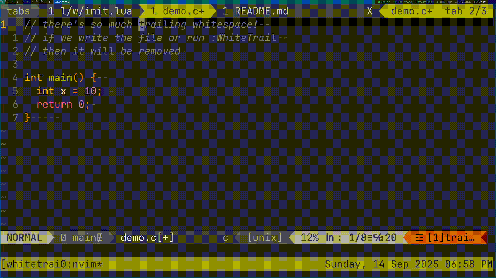

# ⬜ White Trail
A Neovim plugin to remove trailing whitespace.



## 📖 Usage
Whenever files are written or the `:WhiteTrail` command is used, all trailing
whitespace will be removed.

## 📦 Installation
Default configuration, using Lazy:
```lua
return {
  "kolin63/whitetrail",

  config = function()
    require("whitetrail").setup({
      whitespace = { " " }
    })
  end
}
```

## 🔧 Configuration
`whitespace` is a table of characters that count as whitespace. When White
Trail checks for whitespace, any of these characters at the end of a line will
be removed.
